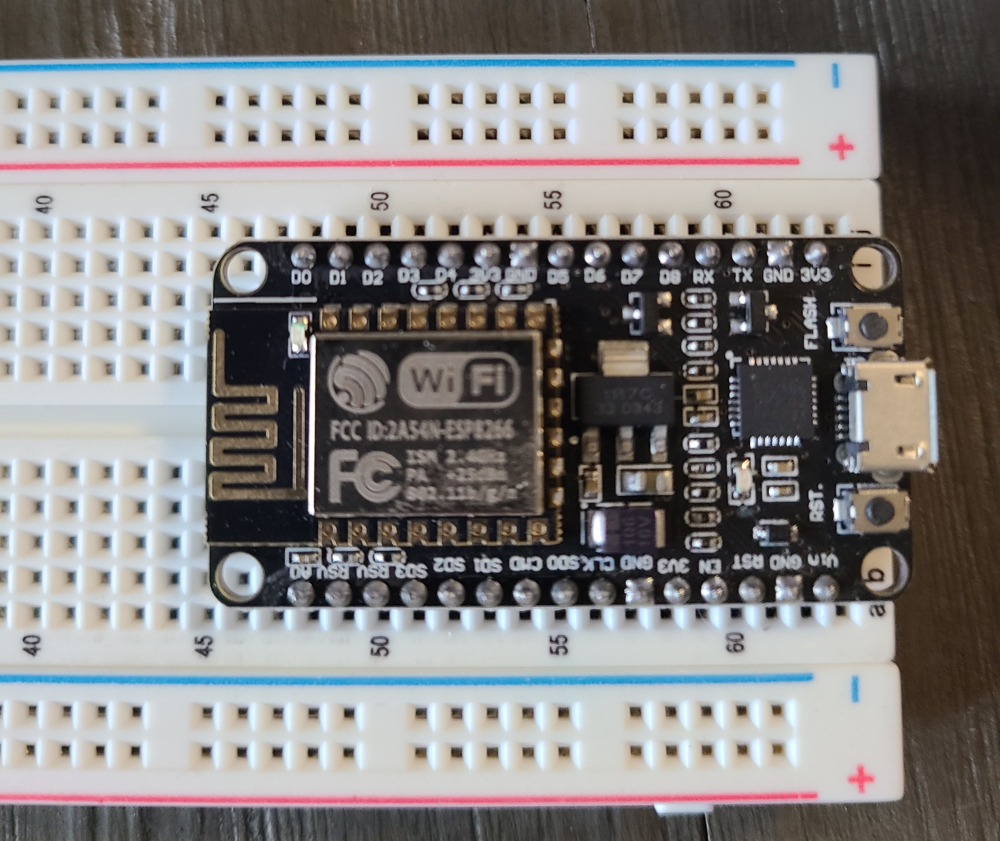
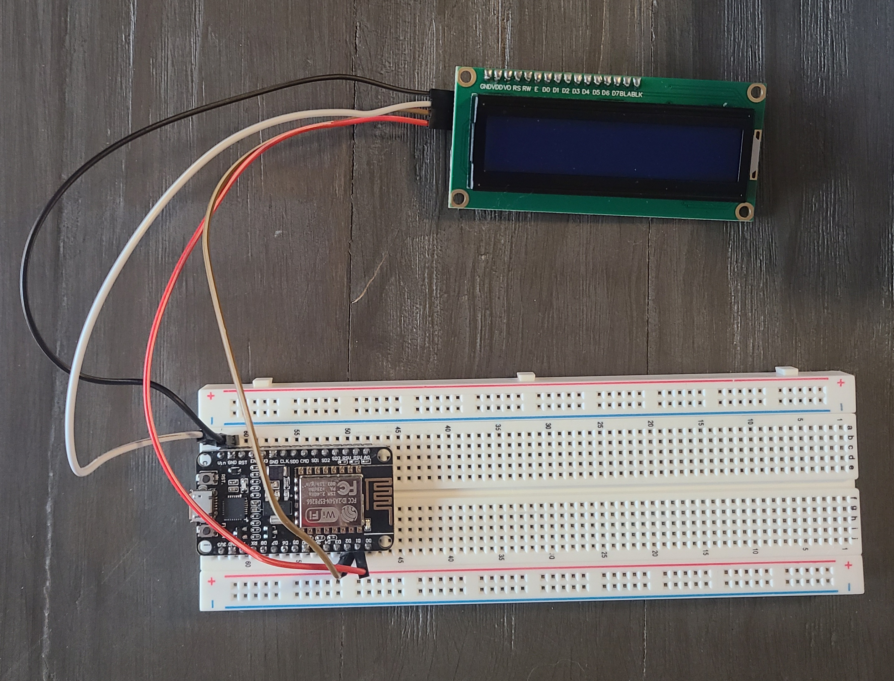

# Create your own live sports display for only $29!  

## 1. Purchase the components

  - ESP8266 - https://a.co/d/5UX7qJE ($8)  
  - LCD1602 w/ I2C Adapter - https://a.co/d/3oDtrIQ ($10)  
  - Breadboard - https://a.co/d/dr5yXGj ($7)    
  - Jumper Wires - https://a.co/d/gr8gANY ($4)

You will also need a way to plug the ESP8266 (Micro USB) into your PC or Laptop and into a wall once setup is complete.
## 2. Create the circuit

Now that you have what you need, you need to connect the display and the wifi chip in a way that they can communicate with each other. First, plug the pins of the ESP8266 into the breadboard, leaving room for the jumper cables to be plugged in on the bottom and top of the breadboard, like so:  

Next, get four individual jumper cables and use the following instructions to plug the LCD1602 display into the ESP8266. For each cable plug the female side into the LCD and the male side into the breadboard above or below the corresponding label on the ESP8266.

(LCD1602) GND ---> GND (ESP8266)  
(LCD1602) VCC ---> VIN (ESP8266)    
(LCD1602) SDA --> D2 (ESP8266)    
(LCD1602) SCL ---> D1 (ESP8266)  

Your circuit should look something like this:  

Now just plug in the ESP8266 into your laptop and the circuit is complete!
## 3. Install the code

Now all that's left is to install the necessary code onto the ESP8266 so that it can retrieve live data.  

First head over to https://www.arduino.cc/en/software and download the Arduino IDE onto your machine.  

Once in the IDE, go to the boards manager and install the driver for the ESP8266 board. Then, go to the library manager and install the "LiquidCrystal" and "ArduinoJson" libraries. Make sure the names are exactly the same.  

Now, create a new sketch and copy and paste the code from display.ino into your sketch. At the top of the code you should see a section where you need to put in some of your own information to get the code to work. First put in the name and password of your Wifi network and then the ID of your league using the table below:  

| League      | ID |
| ----------- | ----------- |
| Premier League      | 0       |
| MLB   | 1        |
| NHL   | 2        |
| NFL   | 3        |

For the teamIndex, look up your league's teams in alphabetical order and find where your team is in the list. Keep in mind that indexes start at 0 so if your team is say, 17th in the list, you should type 16 into the code.  

Verify the code using the checkmark button and then upload the code to the ESP8266 using the arrow button. It will take a second.  

Once the code is done uploading, the setup is complete! All you need to do now is plug the ESP8266 into a wall outlet and find a good spot to put your scoreboard!
