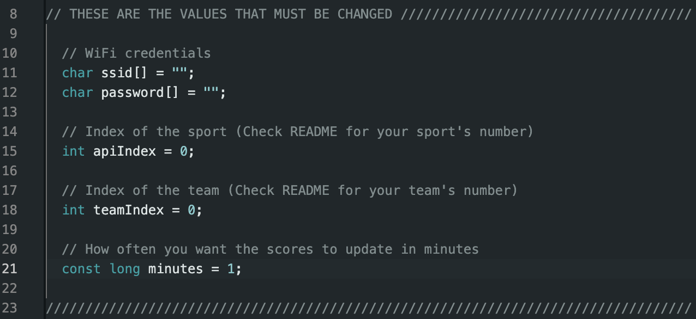

# Create your own live sports display for only $29!

Features functionality for Premier League, NFL, NBA, NHL, and MLB!

Have you ever wanted a live sports display for your home but didn't want to spend more than $100 to do so? This cheap sports display will display your favorite team's most recent game at all times, including live scores that update as often as you want! Below are instructions to setup your own live sports display.

## 1. Purchase the components

  - ESP8266 - https://a.co/d/5UX7qJE ($8)  
  - LCD1602 w/ I2C Adapter - https://a.co/d/3oDtrIQ ($10)  
  - Breadboard - https://a.co/d/dr5yXGj ($7)    
  - Jumper Wires - https://a.co/d/gr8gANY ($4)

You will also need a way to plug the ESP8266 (Micro USB) into your PC or Laptop and into a wall once setup is complete.
## 2. Create the circuit

Now that you have what you need, you need to connect the display and the wifi chip in a way that they can communicate with each other. First, plug the pins of the ESP8266 into the breadboard, leaving room for the jumper cables to be plugged in on the bottom and top of the breadboard, like so:  

Next, get four individual jumper cables and use the following instructions to plug the LCD1602 display into the ESP8266. For each cable plug the female side into the LCD and the male side into the breadboard above or below the corresponding label on the ESP8266.

(LCD1602) GND ---> GND (ESP8266)  
(LCD1602) VCC ---> VIN (ESP8266)    
(LCD1602) SDA --> D2 (ESP8266)    
(LCD1602) SCL ---> D1 (ESP8266)  

Your circuit should look something like this:  

Now just plug in the ESP8266 into your laptop and the circuit is complete!
## 3. Install the code

Now all that's left is to install the necessary code onto the ESP8266 so that it can retrieve live data.  

First head over to https://www.arduino.cc/en/software and download the Arduino IDE onto your machine.  

Once in the IDE, go to the boards manager and install the driver for the ESP8266 board. Then, go to the library manager and install the "LiquidCrystal" and "ArduinoJson" libraries. Make sure the names are exactly the same.  

Now, create a new sketch and copy and paste the code from display.ino into your sketch. At the top of the code you should see a section where you need to put in some of your own information to get the code to work:  

First put in the name and password of your Wifi network and then the ID of your league using the table below:  

| League      | ID |
| ----------- | ----------- |
| Premier League      | 0       |
| MLB   | 1        |
| NHL   | 2        |
| NFL   | 3        |
| NBA   | 4        |

For the teamIndex, use the following tables and look up your team's index:

##  Premier League
NOTE: Premier League teams change annually, so this table may be outdated. You may need to set teamIndex to 0, go down in the code and change the "57" in the top left of teamIds to your teams id for the football-data.org API.
|Arsenal|Aston Villa|Brentford|Brighton and Hove Albion|Bournemouth|Burnley|Chelsea|Crystal Palace|Everton|Fulham|Liverpool|Luton Town|Manchester City|Manchester United|Newcastle United|Nottingham Forest|Sheffield United|Tottenham Hotspur|West Ham United|Wolverhampton Wanderers|
|---|---|---|---|---|---|---|---|---|---|---|---|---|---|---|---|---|---|---|---|
|0|1|2|3|4|5|6|7|8|9|10|11|12|13|14|15|16|17|18|19|

##  MLB
| Arizona Diamondbacks | Atlanta Braves | Baltimore Orioles | Boston Red Sox | Chicago Cubs | Chicago White Sox | Cincinnati Reds | Cleveland Guardians | Colorado Rockies | Detroit Tigers | Houston Astros | Kansas City Royals | Los Angeles Angels | Los Angeles Dodgers | Miami Marlins | Milwaukee Brewers | Minnesota Twins | New York Mets | New York Yankees | Oakland Athletics | Philadelphia Phillies | Pittsburgh Pirates | San Diego Padres | San Francisco Giants | Seattle Mariners | St. Louis Cardinals | Tampa Bay Rays | Texas Rangers | Toronto Blue Jays | Washington Nationals |
|----------------------|----------------|-------------------|----------------|--------------|------------------|-----------------|---------------------|------------------|----------------|----------------|--------------------|--------------------|---------------------|---------------|-------------------|------------------|----------------|------------------|------------------|-----------------------|---------------------|-------------------|-------------------------|------------------|----------------------|-----------------|---------------|------------------|---------------------|
|0|1|2|3|4|5|6|7|8|9|10|11|12|13|14|15|16|17|18|19|20|21|22|23|24|25|26|27|28|29|

## NHL
|Anaheim Ducks|Arizona Coyotes|Boston Bruins|Buffalo Sabres|Calgary Flames|Carolina Hurricanes|Chicago Blackhawks|Colorado Avalanche|Columbus Blue Jackets|Dallas Stars|Detroit Red Wings|Edmonton Oilers|Florida Panthers|Los Angeles Kings|Minnesota Wild|Montreal Canadiens|Nashville Predators|New Jersey Devils|New York Islanders|New York Rangers|Ottawa Senators|Philadelphia Flyers|Pittsburgh Penguins|San Jose Sharks|Seattle Kraken|St. Louis Blues|Tampa Bay Lightning|Toronto Maple Leafs|Vancouver Canucks|Vegas Golden Knights|Washington Capitals|Winnipeg Jets|
|---|---|---|---|---|---|---|---|---|---|---|---|---|---|---|---|---|---|---|---|---|---|---|---|---|---|---|---|---|---|---|---|
|0|1|2|3|4|5|6|7|8|9|10|11|12|13|14|15|16|17|18|19|20|21|22|23|24|25|26|27|28|29|30|31|

## NFL
|Arizona Cardinals|Atlanta Falcons|Baltimore Ravens|Buffalo Bills|Carolina Panthers|Chicago Bears|Cincinnati Bengals|Cleveland Browns|Dallas Cowboys|Denver Broncos|Detroit Lions|Green Bay Packers|Houston Texans|Indianapolis Colts|Jacksonville Jaguars|Kansas City Chiefs|Las Vegas Raiders|Los Angeles Chargers|Los Angeles Rams|Miami Dolphins|Minnesota Vikings|New England Patriots|New Orleans Saints|New York Giants|New York Jets|Philadelphia Eagles|Pittsburgh Steelers|San Francisco 49ers|Seattle Seahawks|Tampa Bay Buccaneers|Tennessee Titans|Washington Football Team|
|---|---|---|---|---|---|---|---|---|---|---|---|---|---|---|---|---|---|---|---|---|---|---|---|---|---|---|---|---|---|---|---|
|0|1|2|3|4|5|6|7|8|9|10|11|12|13|14|15|16|17|18|19|20|21|22|23|24|25|26|27|28|29|30|31|

## NBA
|Atlanta Hawks|Boston Celtics|Brooklyn Nets|Charlotte Hornets|Chicago Bulls|Cleveland Cavaliers|Dallas Mavericks|Denver Nuggets|Detroit Pistons|Golden State Warriors|Houston Rockets|Indiana Pacers|LA Clippers|Los Angeles Lakers|Memphis Grizzlies|Miami Heat|Milwaukee Bucks|Minnesota Timberwolves|New Orleans Pelicans|New York Knicks|Oklahoma City Thunder|Orlando Magic|Philadelphia 76ers|Phoenix Suns|Portland Trail Blazers|Sacramento Kings|San Antonio Spurs|Toronto Raptors|Utah Jazz|Washington Wizards|
|---|---|---|---|---|---|---|---|---|---|---|---|---|---|---|---|---|---|---|---|---|---|---|---|---|---|---|---|---|---|
|0|1|2|3|4|5|6|7|8|9|10|11|12|13|14|15|16|17|18|19|20|21|22|23|24|25|26|27|28|29|

Lastly, put in how often you want the scores to update in minutes

Verify the code using the checkmark button and then upload the code to the ESP8266 using the arrow button. It will take a second.  

Once the code is done uploading, the setup is complete! All you need to do now is plug the ESP8266 into a wall outlet and find a good spot to put your scoreboard!

Note: If you find that the characters on the display are too dark, you can use a small Phillips-Head screwdriver to adjust the blue potentiometer on the back of the display.  

Note: Premier League and NFL scores may not work properly if API limits are reached.
